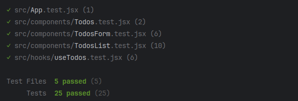

## Testing
- you can run tests in this repository with the following command:

```bash
yarn test
```

- tests are implemented with Vitest and React Testing Library.
- currently all files are fully tested. 



- to ensure that only required functions are being exported from `useTodos`, I'm using the following `environment` check to only export `getTodos` for testing purposes:

```js
  if (process.env.NODE_ENV === "test") {
    return { todos, deleteTodo, addTodo, toggleTodo, getTodos };
  }
  return { todos, deleteTodo, addTodo, toggleTodo };
```